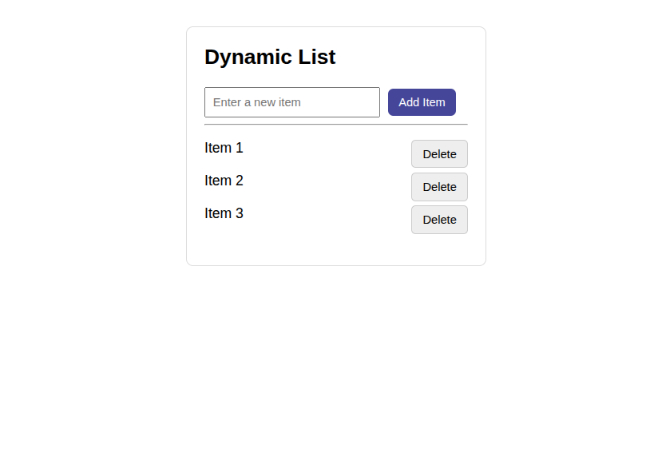

# 📝 Dynamic List (jQuery)

A simple dynamic list built with **jQuery**.  
Users can:

- Add new items.
- Delete items with a fade-out animation.
- Get an error message if they try to add an empty item.

---

## 🚀 Live Demo

Check out the deployed version here:  
👉 [Dynamic List on GitHub Pages](https://saeedkhal.github.io/task-list)

---

## 📸 Screenshot



---

## ⚡ Features

- Add items dynamically.
- Delete items with a smooth fade-out.
- Error message fades out after 2 seconds.
- Responsive and clean design.

---

## 🛠️ How to Run Locally

1. Clone this repo:
   ```bash
   git clone https://github.com/YOUR-USERNAME/YOUR-REPO-NAME.git
   ```
